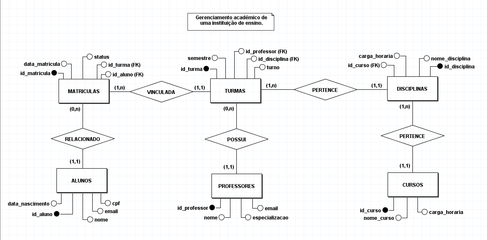

# 🎓 Sistema de Gestão Acadêmica — PostgreSQL

Projeto pessoal de banco de dados relacional desenvolvido com PostgreSQL, inspirado em uma atividade proposta pelo professor de Banco de Dados da Estácio.

O objetivo foi consolidar na prática os principais conceitos de banco de dados relacional, desde a modelagem até consultas avançadas.

---

## 🛠️ Tecnologias Utilizadas

- **PostgreSQL** — SGBD relacional
- **Supabase** — Hospedagem do banco em nuvem
- **DBeaver** — Administração e desenvolvimento SQL
- **pgAdmin 4** — Execução e testes de consultas
- **GitHub** — Versionamento dos scripts SQL
- **brModelo** — Modelagem do DER
---

## 📋 Funcionalidades Implementadas

### DDL
- Criação do banco de dados.
- Criação das tabelas com chaves primárias e estrangeiras.

### DML
- Inserção de dados (60 alunos, 5 professores, 3 cursos, 8 disciplinas, 4 turmas, 60 matrículas).
- Atualização de email de aluno, status de matrícula e professor de turma.
- Exclusão de matrícula e turma sem vínculo.

### Consultas
- Consultas simples com filtros e ordenação.
- Consultas com múltiplas tabelas usando JOIN.
- Subqueries, GROUP BY, HAVING e CASE.

### Bônus
- Views para consultas reutilizáveis.
- Índices para otimização de performance.

---

## 📁 Estrutura do Repositório

```
gestao-academica-db/
├── banco_de_dados/
│   ├── tabelas.sql           # Criação do banco e das tabelas
│   ├── insercao_dados.sql    # Inserção dos dados
│   ├── manipulacao_dados.sql # UPDATE e DELETE
│   ├── consultas.sql         # Consultas simples e com JOIN/Views
│   ├── views.sql             # Criação das Views
│   └── indices.sql           # Criação dos Índices
├── imagens/
│   ├── DER_gestao_academica.png
│   └── MR_gestao_academica.png
└── modelagem/
    ├── DER_gestao_academica.brM3
    └── MR_gestao_academica.brM3
```

---

## 📄 Diagrama Entidade-Relacionamento (DER)



---

## 📊 Views Criadas

| View | Descrição |
|---|---|
| `vw_alunos_ativos` | Alunos com matrícula ativa |
| `vw_aulas_dos_alunos` | Aluno, disciplina, professor e semestre |
| `vw_aluno_por_turma` | Quantidade de alunos por turma |
| `vw_disciplinas_dos_cursos` | Disciplinas de cada curso |
| `vw_cursos_disciplinas_min` | Cursos com mais de 2 disciplinas |
| `vw_status_alunos` | Situação atual de cada aluno |

---

## 👤 Autor
**Lucas Henrique Dias de Medeiros**

[](https://www.linkedin.com/in/lucas-henrique-dias-345666346/)
[](https://github.com/lucas-henriquedias)
[](mailto:lucasfaculdade2025@gmail.com)

---

## 📄 Licença
Este projeto está sob a Licença MIT.
[](LICENSE)


